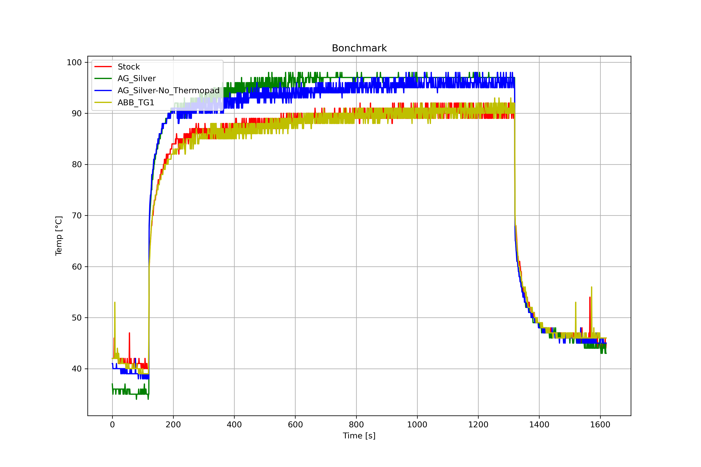

# Bonchmark

A simple cooling benchmarking tool. Runs a stress test and measures CPU package temperature every second.

## Requirements

- [lm_sensors](https://wiki.archlinux.org/index.php/Lm_sensors) package, which provides the `sensors` binary.
- [stress](https://wiki.archlinux.org/index.php/Stress_testing#stress) package.
- Python>=3.6 and [matplotlib](https://pypi.org/project/matplotlib/) package.

## Running

### Stress test

`./bonchmark output_dir`

By default, the benchmark consists of:

- 120s of idle, cooldown time,
- 1200s of stress test on 4 CPUs,
- 300s of idle, cooldown time.

The default values can be changed by editing the [bonchmark](bonchmark) Bash script.

### Graphing

`python graph.py dir_1 dir_2 ... dir_n`

- Supports unique coloring for up to 8 input datasets (log directories).

- You may need to tweak the `_JSON_KEYS_TEMPERATURE` attribute in the `TemperatureMeasurementLog` class to suit your logs. The keys should lead to the CPU temperature value in the JSON document.

- The resulting graph is saved under current working directory as a PNG file with a timestamp as the name, such as: 
  `2020-07-05_17:11:40.483920.png`.
